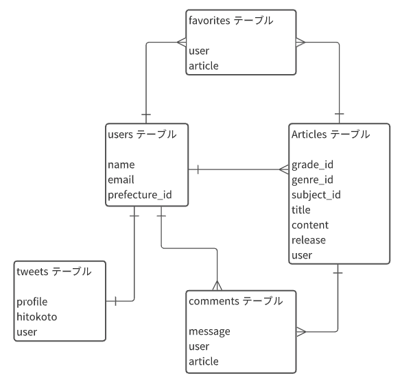

# README

## アプリケーション名
さいてき！

## アプリケーション概要
自分が勉強したことのアウトプットや、分からないことの質問などができる、学生のための勉強アプリ。  
親や先生など「勉強を教えたい」という人も利用することができる。

## URL
https://saiteki-app.herokuapp.com/

## テスト用アカウント
メールアドレス：test@sample.com  
パスワード：123abc  

## 利用方法
ログインしていない状態でも、投稿された記事の閲覧ができる。  
記事やコメントを投稿する場合はまず新規ユーザー登録をし、アカウントを作成する。  
ページ右側のサイドメニューから「新規投稿」をクリックすると、記事の投稿ができる。  
記事のジャンルは「質問」「勉強法」「アウトプット」などから選ぶ。  
記事詳細のページ下部にはコメント欄があり、そこで他のユーザーとやりとりをすることができる。  

## 目指した課題解決
勉強の仕方が分からない、参考書を読んだりネットで調べたりなどどれが適した方法か分からない、という学生の課題を解決することを目的とした。  
他のユーザーの勉強法などから学ぶことができる。  
また学んだアウトプットをすることによって、知識の定着をさせることができる。 
学生以外でも、自分の学んだことを人に伝えたい、役立ててほしいという思いを表現できる場となっている。  

## 洗い出した要件
### ユーザー登録機能
deviseを用いてユーザー登録機能を実装することで、ユーザーオリジナルのページを作る。
### 記事投稿機能
質問や勉強法などを自由に投稿することができる。
### アイコン機能
各ユーザーにアイコン画像を設定し、ユーザーごとの個性を表現できる。
### ひとこと機能
自分の近況を端的に一言で表し、他のユーザーから「この人はどういう人なんだろう」ということが簡単に分かる。
### コメント機能
各記事でユーザー同士がコメント投稿によってコミュニケーションをとれる。
### カテゴリー機能
学年や教科別に記事を探すことができる。
### いいね機能
気に入った記事に対して「いいね」をすることができる。
### 検索機能
キーワードを入力して記事を探すことができる。

## 実装した機能についてのGIFと説明
トップページと各記事のページ  
  
ユーザー詳細ページ  


## 実装予定の機能

## データベース設計
ER図  
  

## ローカルでの動作方法
```
git clone https://github.com/yamazakitakuya1115/saiteki.git
bundle install
yarn install
rails db:create
rails db:migrate
```
Ruby on Rails 6.0.0  
Ruby 2.6.5  


# テーブル設計

## users テーブル
| Column        | Type    | Options     |
| ------------- | ------- | ----------- |
| name          | string  | null: false |
| email         | string  | null: false |
| prefecture_id | integer | null: false |

### Association
- has_many :articles
- has_many :comments
- has_one :tweet
- has_many :favorites

## articles テーブル
| Column     | Type       | Options                           |
| ---------- | ---------- | --------------------------------- |
| grade_id   | integer    | null: false                       |
| genre_id   | integer    | null: false                       |
| subject_id | integer    | null: false                       |
| title      | string     | null: false                       |
| content    | text       | null: false                       |
| release    | boolean    | null: false, default: false       |
| user       | references | null: false, foreign_key: true    |

### Association
- belongs_to :user
- has_many :comments
- has_many :favorites

## comments テーブル
| Column  | Type       | Options                        |
| ------- | ---------- | ------------------------------ |
| message | text       | null: false                    |
| user    | references | null: false, foreign_key: true |
| article | references | null: false, foreign_key: true |

### Association
- belongs_to :user
- belongs_to :article

## tweets テーブル
 | Column   | Type       | Options                        |
 | -------- | ---------- | ------------------------------ |
 | profile  | text       |                                |
 | hitokoto | string     |                                |
 | user     | references | null: false, foreign_key: true |

 ### Association
 - belings_to user

 ## favorites テーブル
 | column  | Type       | Options                        |
 | ------- | ---------- | ------------------------------ |
 | user    | references | null: false, foreign_key: true |
 | article | references | null: false, foreign_key: true |

 ### Association
 - belongs_to user
 - belongs_to article